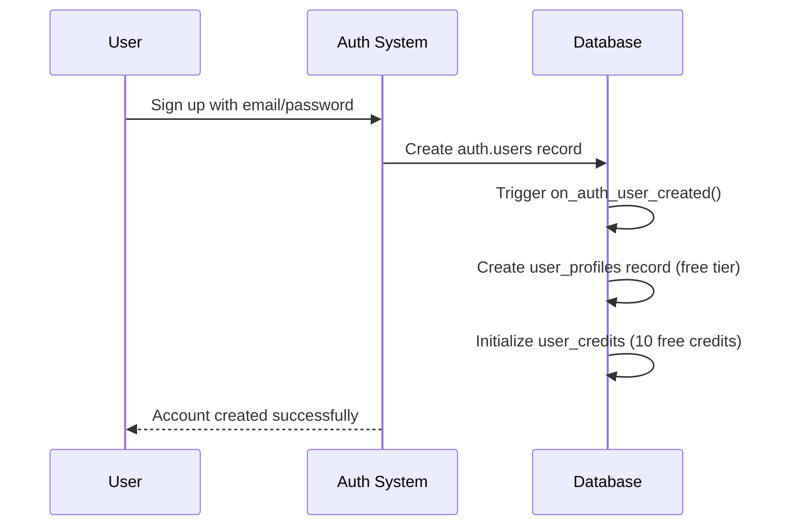
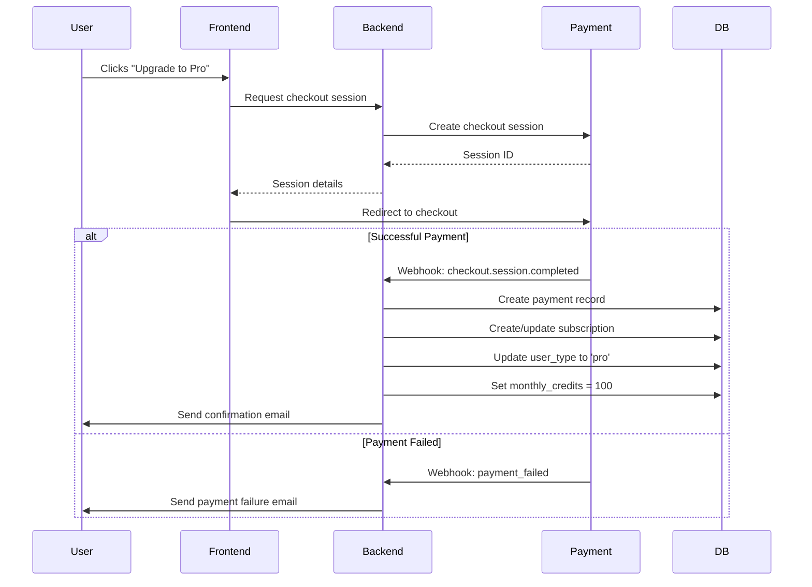
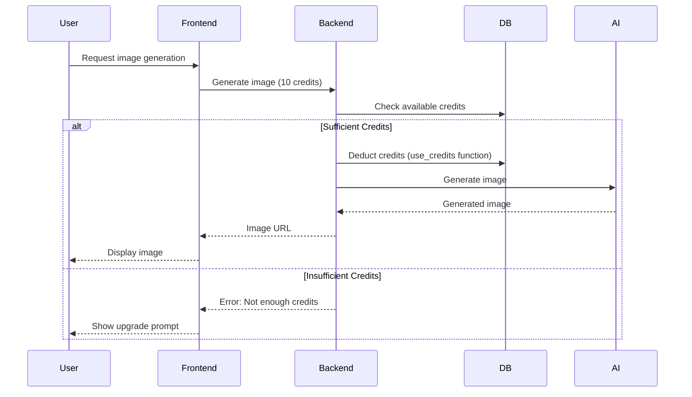

# Brandii Subscription System

This document outlines the architecture and flow of the Brandii subscription system, which handles user plans, payments, and credit management.

## Database Schema

### Core Tables

#### `subscription_plans`
- Stores available subscription plans (Free, Pro)
- Tracks credit allocation and pricing

#### `payments`
- Records all payment transactions
- Supports multiple payment providers (Stripe, PayPal, manual)

#### `user_subscriptions`
- Manages user subscription status
- Tracks billing periods and payment methods

#### `user_credits`
- Tracks available credits (purchased + monthly)
- Handles credit consumption

#### `credit_usage`
- Logs all credit consumption events
- Supports reference tracking (e.g., image generation)

### Enums

#### `payment_provider`
- `stripe`
- `paypal`
- `manual`

#### `subscription_status`
- `active`
- `canceled`
- `incomplete`
- `incomplete_expired`
- `past_due`
- `paused`
- `trialing`
- `unpaid`
- `expired`

#### `user_type`
- `free`
- `pro`
- `admin`

## User Flows

### 1. New User Signup


### 2. Plan Upgrade (Free → Pro)


### 3. Credit Usage (e.g., Image Generation)


## Key Functions

### `handle_new_user()`
- **Trigger**: Automatically runs on new user creation
- **Actions**:
  - Creates user profile with default 'free' type
  - Initializes user with 10 free credits

### `use_credits(p_user_id, p_credits_to_use, p_description, ...)`
- **Purpose**: Safely deduct credits from user's balance
- **Behavior**:
  1. Locks user's credit row to prevent race conditions
  2. Uses monthly credits first, then purchased credits
  3. Logs the transaction in credit_usage
  4. Returns boolean success/failure

### `refresh_monthly_credits(user_id, monthly_credits)`
- **Purpose**: Resets monthly credits for subscribed users
- **Trigger**: Called on subscription creation/renewal
- **Actions**:
  - Sets monthly_credits to plan amount
  - Resets credits_used to 0
  - Updates last_monthly_credit_refresh timestamp

## Integration Guide

### Frontend Implementation
```typescript
// Check available credits
const { data: credits } = await supabase
  .from('user_available_credits')
  .select('*')
  .eq('user_id', userId)
  .single();

// Use credits for an action
const { data: success } = await supabase.rpc('use_credits', {
  p_user_id: userId,
  p_credits_to_use: 10,
  p_description: 'Image generation',
  p_reference_type: 'image_generation'
});
```

### Webhook Handling (Stripe Example)
```typescript
// Handle successful payment
app.post('/api/webhooks/stripe', async (req, res) => {
  const sig = req.headers['stripe-signature'];
  const event = stripe.webhooks.constructEvent(
    req.body,
    sig,
    process.env.STRIPE_WEBHOOK_SECRET
  );

  if (event.type === 'checkout.session.completed') {
    const session = event.data.object;
    await handleSuccessfulPayment(session);
  }
  
  res.json({ received: true });
});
```

## Security Considerations

1. **Row Level Security (RLS)**: All tables have RLS policies to ensure users can only access their own data
2. **Webhook Security**: Always verify webhook signatures from payment providers
3. **Idempotency**: Implement idempotency keys for credit transactions to prevent double-spending
4. **Rate Limiting**: Protect credit deduction endpoints from abuse

## Testing

1. **Unit Tests**:
   - Credit deduction logic
   - Subscription state transitions
   - Webhook handlers

2. **Integration Tests**:
   - End-to-end subscription flow
   - Credit usage scenarios
   - Payment failure recovery

## Monitoring

1. **Key Metrics**:
   - Failed payment rate
   - Credit consumption rate
   - Subscription churn

2. **Alerts**:
   - Failed webhook deliveries
   - Credit balance anomalies
   - Payment processing errors
